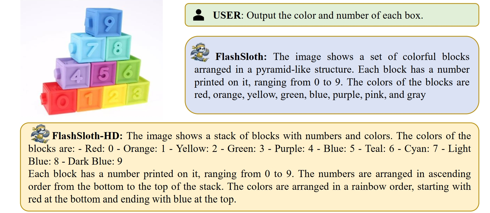

<p align="center">
    
<p>

<h4 align="center">⚡<a href="https://arxiv.org/abs/2412.04317">FlashSloth: Lightning Multimodal Large Language Models via Embedded Visual Compression ⚡</a></h4>  
[](https://huggingface.co/Tongbo)
[](https://github.com/codefanw/FlashSloth/blob/main/LICENSE)   [](https://arxiv.org/abs/2412.04317)

<hr style="border: 1px solid #000; width: 80%; margin: auto;">

## 👣Introduction

This repository implements FlashSloth, an innovative lightweight multimodal large language model (MLLM). Through a unique embedded visual compression design, FlashSloth significantly enhances the descriptive capabilities of visual tokens while maintaining exceptional performance, even with a substantial reduction in visual token count. 


### Key advantages:

- **Enhanced Visual Feature Description:** Even when compressing visual features by 9 times, the model's performance remains comparable to its original version, demonstrating extraordinary feature extraction and compression capabilities.
- **Extremely Low Training Costs:** Compared to similar models, FlashSloth demonstrates remarkable computational efficiency during training. Requiring only 6.4 GPU hours and 12GB of memory per GPU card to complete pre-training represents a significant resource optimization.
- **Superior Inference Efficiency:** In critical metrics such as TFLOPs, GPU memory usage, response time, and throughput, FlashSloth dramatically outperforms other lightweight MLLMs. Check out [our paper](https://arxiv.org/abs/2412.04317).
- **Outstanding Model Performance:** Despite using relatively limited training data, FlashSloth maintains competitive performance with current state-of-the-art (SOTA) methods and even achieves superior results in several visual language (VL) tasks. For instance, scoring 75.7 on the MMB benchmark and 75.3 on the AI2D dataset. Check out our [Model Zoo](https://github.com/codefanw/FlashSloth/tree/main?tab=readme-ov-file#model-zoo)

### Model Architecture Updates:

FlashSloth enhances visual feature description by ingeniously integrating Spatial Attention Pooling (SAP) and Embedded Query Module (EmbQ), enabling precise and efficient visual information extraction:


- **Spatial Attention Pooling (SAP)**: This module employs an intelligent attention weight allocation strategy, selectively aggregating visual features within image regions. SAP effectively compresses redundant visual tokens while capturing the most salient and meaningful visual characteristics, achieving information distillation and concentration.
- **Embedded Query Module (EmbQ)**: A lightweight and highly integrated module within the FlashSloth architecture, EmbQ directly extracts instruction-relevant information from images. By eliminating the need for additional language modeling or complex alignment pre-training, the module simplifies the model design while significantly improving multi-modal input processing efficiency and accuracy.

The synergistic interaction between these two modules enables FlashSloth to achieve precise visual understanding and efficient representation while maintaining model lightweight characteristics.


## 📣 News

- **[2024.12.05]** 🔥🔥🔥 We release the model architecture and training code for FlashSloth, and provide two evaluation methods.
- **[2024.12.06]** 🚀 We release our paper on arXiv: FlashSloth: Lightning Multimodal Large Language Models via Embedded Visual Compression.
- **[2024.12.28]** 💫 We release our model weights on HuggingFace. Enjoy it!

## 🗓️TODO

- [x] Release training codes.
- [x] Release evaluating and inferencing codes.
- [x] Release paper.
- [x] Release checkpoints.
- [x] Release demo.
- [ ] Release the model with stronger Chinese language capabilities.
- [ ] Deployment on edge devices.
- [ ] Support more modalities, e.g., audio and video.


## 🥤Contents

- [Setup](https://github.com/codefanw/FlashSloth/blob/main/README.md#%EF%B8%8F-setup)
- [Training](https://github.com/codefanw/FlashSloth/tree/main?tab=readme-ov-file#training)
- [Evaluation&Inference](https://github.com/codefanw/FlashSloth/tree/main?tab=readme-ov-file#evaluation)
- [Model Zoo](https://github.com/codefanw/FlashSloth/tree/main?tab=readme-ov-file#model-zoo)


## 🛠️ Setup

1. Clone this repository and navigate to FlashSloth folder

   ```
   git clone https://github.com/codefanw/FlashSloth.git
   cd FlashSloth
   ```

2. Install Package

   ```
   conda create -n flashsloth python=3.10 -y
   conda activate flashsloth
   pip install -r requirements.txt
   pip install flash-attn==2.4.2 --no-build-isolation
   ```


## 🚀Training

The training procedure for FlashSloth consists of two stages:

- **Stage I: Pretraining**
  - ❄️ Vision Encoder + 🔥 Projector & Spatial Attention Pooling + ❄️ Query Tokens+ ❄️ Embedded Query Module + ❄️ LLM
  - This stage takes approximately 0.8 hours with a batch size of 256 and requires around 12 GB of GPU memory on average.
- **Stage II: Instruction Tuning**
  - **FlashSloth**: ❄️ Vision Encoder + 🔥 Projector & Spatial Attention Pooling + 🔥 Query Tokens+🔥 Embedded Query Module + 🔥 LLM
  - **FlashSloth_HD**: 🔥 Vision Encoder + 🔥 Projector & Spatial Attention Pooling + 🔥 Query Tokens+🔥 Embedded Query Module + 🔥 LLM
  - This stage takes about 8 hours for FlashSloth, utilizing 8x A800 (80 GB) GPUs, with a batch size of 128 and an average GPU memory requirement of 47 GB.

**Note**: To train with fewer GPUs or less memory, you can decrease the `per_device_train_batch_size` and increase `gradient_accumulation_steps` accordingly. However, always ensure that the global batch size remains consistent: `per_device_train_batch_size × gradient_accumulation_steps × number of GPUs`.

### Prepare checkpoints

```
export HF_ENDPOINT=https://hf-mirror.com  
#(option) If you cannot access Hugging Face directly, you can use this command to access it via a mirror.
python scripts/download_models.py
```

### Prepare datas

If you want to train using the data provided by [LLaVA-v1.5](https://github.com/haotian-liu/LLaVA), you can follow the steps below:

- prepare alignment pre-training data

  Please download the caption annotations `blip_laion_cc_sbu_558k.json` and images from [here](https://huggingface.co/datasets/liuhaotian/LLaVA-Pretrain).

- prepare instruction tuning data

  Please download the annotation file of the mixed instruction tuning data [llava_v1_5_mix665k.json](https://huggingface.co/datasets/liuhaotian/LLaVA-Instruct-150K/blob/main/llava_v1_5_mix665k.json), and download the images from constituting datasets:

  - COCO: [train2017](http://images.cocodataset.org/zips/train2017.zip)
  - GQA: [images](https://downloads.cs.stanford.edu/nlp/data/gqa/images.zip)
  - OCR-VQA: [download script](https://drive.google.com/drive/folders/1_GYPY5UkUy7HIcR0zq3ZCFgeZN7BAfm_?usp=sharing), **save all files as `.jpg`**
  - TextVQA: [train_val_images](https://dl.fbaipublicfiles.com/textvqa/images/train_val_images.zip)
  - VisualGenome: [part1](https://cs.stanford.edu/people/rak248/VG_100K_2/images.zip), [part2](https://cs.stanford.edu/people/rak248/VG_100K_2/images2.zip)

### Training

- **Save model:** This step combines the vision encoder with the large language model to form FlashSloth and initializes the newly added parameters to ensure the proper functioning of Zero3.

```
bash scripts/save.sh 
```

- **Multimodal pretraining:**

```
bash scripts/pretrain.sh 
```

- **Multimodal instruction tuning**: If you want to train a high-resolution version of FlashSloth, set `image_hd` to `True`.

```
bash scripts/finetune.sh 
```


## ⚡Evaluation

We provide two methods to evaluate FlashSloth:

### Way-1: LLaVA-v1.5 

We follow the evaluation protocol of [LLaVA-v1.5](https://github.com/haotian-liu/LLaVA/tree/main) and conduct experiments on GQA, MMBench, MME, POPE, and TextVQA. All evaluation scripts are available in the `scripts/eval` directory. To prepare the task-specific data, download [eval.zip](https://drive.google.com/file/d/1atZSBBrAX54yYpxtVVW33zFvcnaHeFPy/view?usp=sharing) and extract it to the `./playground/data/eval` directory. For detailed instructions, please refer to [LLaVA's Evaluation.md](https://github.com/haotian-liu/LLaVA/blob/main/docs/Evaluation.md). You can easily run the following script to evaluate across five tasks:

```
bash scripts/benchmark.sh 
```

### Way-2: lmms-eval (recommend)

For formal usage, you can install the package from PyPI by running the following command:

```
pip install lmms-eval
```

For development, you can install the package by cloning the repository and running the following command:

```
git clone https://github.com/EvolvingLMMs-Lab/lmms-eval
cd lmms-eval
pip install -e .
```

Then, you can run the following script with a single command to evaluate the 14 tasks listed in our paper. Note that some tasks require configuring openai_api.

```
bash eval.sh
```

### Inference

You can run the following command to start the model demo.

```
pip install gradio==3.43.2
python demo.py
```
We have also deployed flashsloth demo on [Hugging Face space](https://huggingface.co/spaces/Tongbo/flashsloth), but it takes a longer time to wake up. If you need to use the online demo, please wait for about 5 minutes.


## 🦥Model Zoo

|     Model     |     Checkpoint     | POPE |  MME   | MMB  | MM-Vet | SEED-Image | MMMU | MathVista | GQA  | SQA  | TextVQA | AI2D | ChartQA | DocVQA | RealWorldQA |
| :-----------: | :----------------: | :--: | :----: | :--: | :----: | :--------: | :--: | :-------: | :--: | :--: | :-----: | :--: | :-----: | :----: | :---------: |
|  FlashSloth   | <u>[FlashSloth](https://huggingface.co/Tongbo/FlashSloth-3.2B)</u> | 86.3 | 1702.0 | 73.0 |  41.9  |    68.0    | 39.7 |   42.5    | 61.1 | 88.6 |  64.6   | 72.5 |  51.0   |  48.6  |    54.8     |
| FlashSloth_HD | <u>[FlashSloth_HD](https://huggingface.co/Tongbo/FlashSloth_HD-3.2B)</u> | 87.2 | 1745.0 | 75.7 |  49.0  |    71.2    | 37.8 |   40.6    | 62.5 | 91.1 |  71.0   | 75.3 |  69.8   |  74.8  |    59.9     |


In order to help reproduce our results, we also provide the weights after the first-stage training:[FlashSloth-stage1](https://huggingface.co/Tongbo/FlashSloth-3.2B-Stage1)


## 🤝 Acknowledgments

- **[LLaVA](https://github.com/haotian-liu/LLaVA) and [IMP](https://github.com/MILVLG/imp)**: For providing the codebase we built upon. Thanks for their excellent work!
- **[Phi](https://hf-mirror.com/microsoft/phi-2) and [Siglip](https://hf-mirror.com/google/siglip-so400m-patch14-384)**: For the amazing open-sourced base models used in our work.
- **[lmms-eval](https://github.com/EvolvingLMMs-Lab/lmms-eval)**: For providing the great open-sourced evaluation framework.


## 🌟 Star History

[](https://star-history.com/#codefanw/FlashSloth&Date)

## ✨ Example
<p align="center">
  
</p>
<p align="center">
  
</p>
<p align="center">
  
</p>
<p align="center">
  
</p>
<p align="center">
  
</p>
<p align="center">
  
</p>

## ✏️ Citation

If you find our paper and code helpful, we kindly invite you to give it a star and consider citing our work.

```bibtex
@article{tong2024flashsloth,
  title={FlashSloth: Lightning Multimodal Large Language Models via Embedded Visual Compression},
  author={Tong, Bo and Lai, Bokai and Zhou, Yiyi and Luo, Gen and Shen, Yunhang and Li, Ke and Sun, Xiaoshuai and Ji, Rongrong},
  journal={arXiv preprint arXiv:2412.04317},
  year={2024}
}
```
